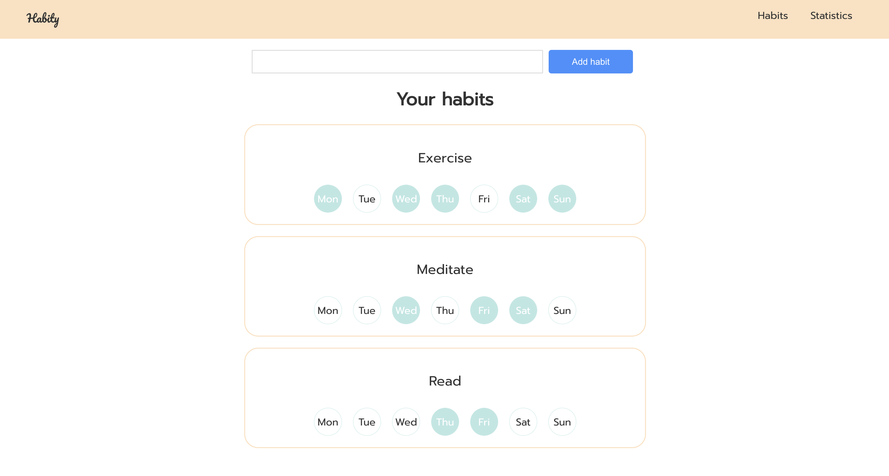

## Welcome to the Habit Tracker!
This app is designed to help you track your daily habits and measure your progress over time.



### Features
- Keep a list of your habits, along with a tracker for each day of the week
- Add new habits to your list using the form provided
- View statistics that show your progress for each habit on a weekly, monthly, and quarterly basis
- Edit and delete habits as needed

### Instructions for Running the Project
1) Start the backend by navigating to the backend directory and running the following commands:

```
npm install
npm run dev
```


2) Start the project by navigating to the root directory and running the following command:

```
npm start
```

> **Note** 
> Ensure that you have Node.js and npm installed on your computer before running these commands.
